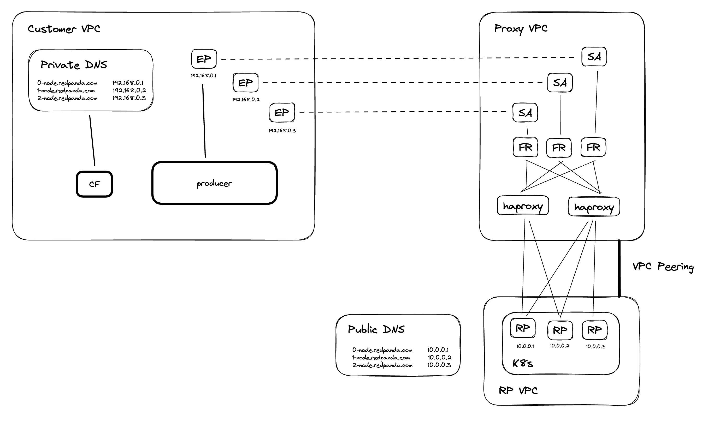
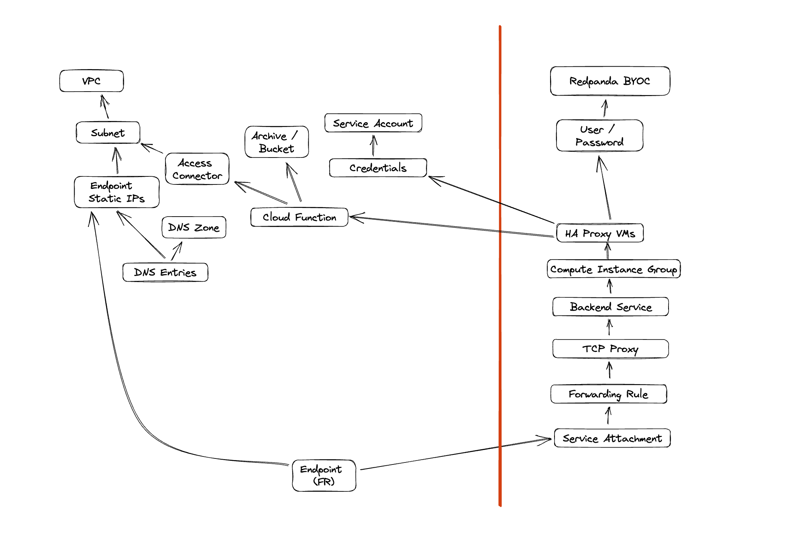

# Overview

This [Redpanda Labs](https://github.com/redpanda-data/redpanda-labs) project provides a workaround for adding Private Service Connect to a Redpanda cluster. IT uses HAProxy VMs as an access layer above the Redpanda brokers, in order to provide GCP a static target for load balancing.

# Architecture

A simplified representation of the architecture is shown below:

Points to note:

- There are multiple PSC endpoints created - one per broker / port combo
- A private DNS zone is used to allow clients to override the IP location for the hostnames advertised by Redpanda (since clients now need to contact the PSC endpoints rather than the brokers directly)
- The private DNS zone is updated once per minute using a cloud function
- The HAProxy configuration is updated once per minute using the output of `rpk cluster info`
- It is necessary to create a user/password within Redpanda for use by automation, although no topic or group privileges are needed.

# GCP Object Dependencies

A somewhat simplified representation of the dependencies for the artefacts created within GCP are shown below:

